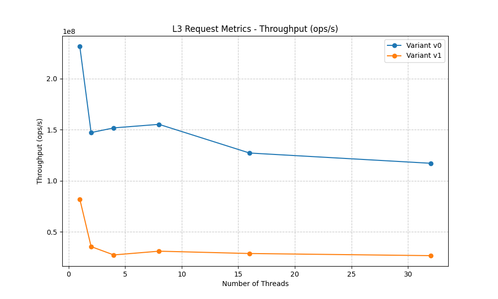
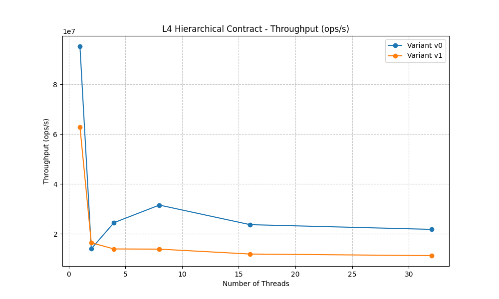

# Useless Locks Benchmark

This repository contains a scientific benchmark designed to evaluate the ability of Large Language Models (LLMs) to detect *useless mutual exclusion mechanisms* (locks) in multithreaded programs.

Locks are widely used to ensure determinism and prevent race conditions in concurrent software. However, unnecessary locks can introduce avoidable latency and complexity. Such locks frequently appear in real-world code bases due to defensive programming, legacy code, automated refactoring, or the use of third-party libraries and generative AI tools.

The goal of this benchmark is **not** to detect race conditions, but to identify situations where mutual exclusion mechanisms are *logically unnecessary*, even though they appear correct and well-structured.

---

## Objectives

The benchmark aims to:

- Evaluate how well LLMs can reason about concurrency, synchronization, and program semantics.
- Measure performance across increasing levels of structural and semantic complexity.
- Identify which aspects of concurrency reasoning are most challenging for current models.
- Provide a reproducible and extensible dataset for future research.

---

## Scope

- Language: **C (POSIX threads)**
- Focus: **mutexes and shared-memory concurrency**
- Analysis type: **static reasoning over source code**
- Target systems: representative of real-world software (servers, runtimes, OS components)

Python is intentionally excluded from the core benchmark due to the Global Interpreter Lock (GIL), which can obscure true concurrency behavior and bias the analysis.

---

## Levels of Complexity

The benchmark is organized into 5 levels, each targeting specific reasoning patterns:

1.  **[Level 0: Trivial](benchmarks/level_0_trivial/README.md)** - Local variables, empty critical sections.
2.  **[Level 1: Basic](benchmarks/level_1_basic/README.md)** - Join-based synchronization, read-after-init patterns.
3.  **[Level 2: Intermediate](benchmarks/level_2_intermediate/README.md)** - Module-level initialization, barrier synchronization.
4.  **[Level 3: Advanced](benchmarks/level_3_advanced/README.md)** - Semantic redundancy (idempotency, approximate monitoring).
5.  **[Level 4: Expert](benchmarks/level_4_expert/README.md)** - Distributed/Structural invariants (hierarchical locking, callback chains).

---

## Results & Analysis (Feb 2026)

We evaluated three state-of-the-art models using the standard protocol defined in `PROTOCOL.md`.

### Performance Overview

| Model | Level 0 | Level 1 | Level 2 | Level 3 | Level 4 | Total |
| :--- | :---: | :---: | :---: | :---: | :---: | :---: |
| **Claude Sonnet 4.5** | 3/3 | 3/3 | 3/3 | 2/3 | 3/3 | **14/15** |
| **GPT-4.1** | 3/3 | 3/3 | 3/3 | 0/3 | 2/3 | **11/15** |
| **Gemini 3 Flash** | 3/3 | 3/3 | 3/3 | 1/3 | 1/3 | **11/15** |

### Key Insights

1.  **The "Semantic Gap" (Level 3)**: Most models struggle with *semantically* useless locks. For instance, **GPT-4.1** correctly identifies that a lock protects shared data, but fails to recognize that the data is *idempotent* or *non-critical* (approximated metrics). It adheres strictly to the C memory model ("Any unsynchronized write is UB"), missing the higher-level engineering context.
2.  **Structural Reasoning (Level 4)**: **Claude** and **GPT-4.1** showed high proficiency in detecting redundant locks in hierarchical systems (where a parent lock already guarantees safety), whereas **Gemini 3 Flash** often missed these "outer-layer" invariants.
3.  **Legacy Artifacts**: All models handled cases where locks protected immutable data or local variables (Level 0/2) with high accuracy, indicating that basic data-flow analysis is well-integrated into these models.

---

## Experiment 2: Impact of Undetected Useless Locks (Feb 2026)

We compared the original benchmark code (**V1** - with useless locks) against a corrected version (**V0** - lock removed) across four representative tests from Levels 3 and 4, with thread counts from 1 to 32.

### Performance Impact Overview

| Benchmark | Level | Max Throughput Loss | Scalability Trend |
| :--- | :---: | :---: | :--- |
| **Request Metrics** | L3 | ~80% | Flatlines early due to mutex contention. |
| **Approximate Monitoring** | L3 | ~90% | Severe bottleneck in high-frequency path. |
| **Degraded Mode** | L4 | **>95%** | Complete failure to scale with thread count. |
| **Hierarchical Contract** | L4 | ~50% | Significant overhead from redundant locking. |

#### Throughput Comparison






### Key Findings

1.  **The Scalability Wall**: In tests like `Degraded Mode`, the useless lock completely prevents the program from benefiting from multiple cores. While the lockless version (V0) scales linearly, the version with the useless lock (V1) remains stuck at roughly single-thread performance.
2.  **Syscall Overhead**: Using `strace`, we observed thousands of unnecessary `futex` system calls in the V1 variants, even when no actual data race would have occurred without the lock. This represents pure wasted kernel time.
3.  **Silent Performance Regression**: These locks are "silent" because they don't cause crashes or incorrect results. However, they introduce non-trivial synchronization costs at the OS level that aggregate into major system inefficiencies.

> [!IMPORTANT]
> These results demonstrate that **useless locks are not benign**. Their presence significantly degrades performance and scalability, making automated detection tools like Delock essential for system efficiency.

---

## Repository Structure

```
useless-locks-benchmark/
├── README.md
├── METHODOLOGY.md
├── AXES.md
├── experiment_2/       # Quantification experiment data & scripts
│   ├── images/         # Performance plots from CloudLab
│   └── runner.py       # Automated execution suite
├── benchmarks/         # Core benchmark test cases
└── results/            # LLM evaluation results
```

Each benchmark test is fully documented and includes a ground-truth justification.

---

## How to Run
- **LLM Benchmark**: See **[PROTOCOL.md](PROTOCOL.md)**.
- **Performance Experiment**: See **[experiment_2/README.md](experiment_2/README.md)** (requires Linux/strace).

## Contributing

We welcome new test cases! Please refer to **[METHODOLOGY.md](METHODOLOGY.md)** and **[AXES.md](AXES.md)** before submitting a Pull Request.
